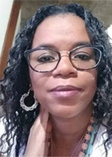
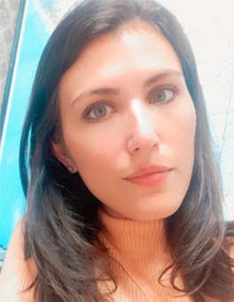
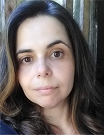
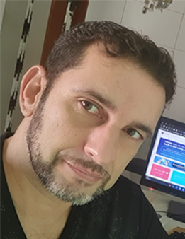

# Projeto Final Módulo 6 - Grupo 8

## Descrição do Projeto:

Você e sua equipe foram escalados novamente pela Procuradoria Geral da
República para dar continuidade a investigação dos gastos dos parlamentares
brasileiros nos anos de 2019, 2020 e 2021. As análises feitas anteriormente
chamaram a atenção da Polícia Federal (PF) para operações que irão ocorrer
simultaneamente em todos os estados. Por isso, o Procurador Geral da
República está solicitando que você e sua equipe apresentem ao seleto grupo de
delegados da PF os fatos encontrados nos gastos dos parlamentares que mais
chamaram a atenção de vocês.
Para isso vocês podem utilizar os resultados encontrados no módulo anterior ou
realizar mais análises sob os dados. Ressaltamos que a Cota para o Exercício
da Atividade Parlamentar é regida por uma série de regras que podem ser
consultadas aqui e que há algumas iniciativas, como o Serenata de Amor, que
visam acompanhar os gastos realizados pelos nossos políticos e podem ser
utilizadas para auxiliar na geração de insights.
Como são muitos parlamentares, a análise das despesas devem ser realizadas
por região. Por tanto, cada equipe será responsável por apresentar suas
análises das despesas dos parlamentares de um estado:

Equipe 01: MT;

Equipe 02: MG;

Equipe 03: SP;

Equipe 04: BA;

Equipe 05: PA;

Equipe 06: MS;

Equipe 07: RS;

Equipe 08: CE;

Equipe 09: TO;

Equipe 10: PR.

Nossa equipe ficou responsável pela análise do Estado do **Ceará**.

Decidimos filtrar as categorias com maiores despesas:

* Divulgação da Atividade Parlamentar;
* Consultorias, Pesquisas e Trabalhos Técnicos;
* Passagem Aérea RPA;
* Locação ou Fretamento de Veículos Automotores;
* Combustíveis e Lubrificantes.

## Apresentação do projeto:

* Conter gráficos adequados para o tipo de dado e informação;
* Utilizar visualizações construídas no Tableau ou Power Bi (o grupo pode escolher qual ferramenta irá utilizar);
* Utilizar conceitos de Storytelling;
* Apresentar em slides (e.g., Power Point, História (Tableau));
* Ser apresentada por todos os integrantes do grupo;
* Ter duração máxima de 10 minutos.

## 🔗 Links

Para acessar os slides da apresentação [clique aqui](https://docs.google.com/presentation/d/1CCsMgET20F2iVtHFUklBdqr-gojXPfWgBSEAW6Jtb48/edit?usp=sharing)

[][1]
[][2]
[][3]
[][4]

[1]: https://www.linkedin.com/in/analu-francisco/

[2]: https://www.linkedin.com/in/brunna-brito/

[3]: https://www.linkedin.com/in/carla-lanzillotta/

[4]: https://www.linkedin.com/in/julianomata/

